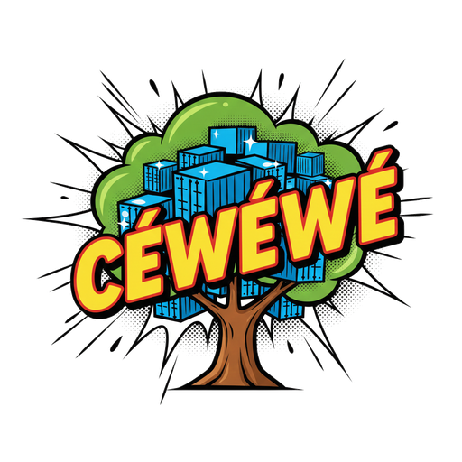

# Coder Workspace Workflow (cww — pronounced céwéwé, /se.ve.ve/)

<p align="center"></p>


**Disposable, full-stack development environments for coding agents.**

Each workspace gets its own clone of your repo, wired into its own Docker Compose network — a coding agent (Claude Code or Mistral Vibe) *plus* the real services your app needs (database, cache, search) — so you can run multiple isolated sessions in parallel. Each session is a disposable, sandboxed container, so the agent runs with permissions skipped — no confirmation prompts, no babysitting. Every workspace also runs a [real headful browser](docs/user-guide.md#built-in-headful-browser) the agent drives and you can watch — or take over (logins, 2FA) — from a browser tab via noVNC.

**Git inside the workspace is yours** — branch, rebase, and push however your team works; cww imposes no workflow.

**Nothing new to trust or learn.** Under the hood cww is deliberately boring: a small, readable TypeScript codebase (running on [Bun](https://bun.sh), zero npm dependencies) driving plain Docker, Compose, and SSH — no daemon, no vendor account. If you can debug `docker` and `ssh`, you can debug cww.

## Make it yours

cww is meant to be cloned or forked, not consumed as a black box. Before adopting it, review what's here — source, Dockerfile, compose templates, docs — decide whether it fits your needs and your security requirements, and adapt anything that doesn't (bake your toolchain into the image, change the defaults, strip what you don't use). The [MIT license](LICENSE) lets you modify and redistribute freely; per that same license, cww is provided **as-is, with no warranty of any kind** — you run it at your own risk. Where the docs describe third-party services (Anthropic's auth and billing, git hosts, Docker), they reflect our understanding when written; verify against those services' own documentation.

## Install

Needs Docker, Git, and [Bun](https://bun.sh) (the installer offers to set it up if missing). On Linux, [rootless Docker](docs/user-guide.md#rootless-docker-recommended) is recommended — it keeps the unattended, permission-skipping agent behind an unprivileged host user.

```bash
git clone https://github.com/sergepetit/cww.git
cd cww
./install.sh          # installs to ~/.local/bin/cww and builds the image
```

Then add your credentials to `~/.cww/env` (mode 600) — an auth token for the agent you use, and a git token so the container can clone and push:

```bash
claude setup-token    # opens browser; copy the sk-ant-oat01-... token

cat >> ~/.cww/env <<'EOF'
CLAUDE_CODE_OAUTH_TOKEN=sk-ant-oat01-...
CWW_GIT_USER=your-login
CWW_GIT_TOKEN=...
EOF
chmod 600 ~/.cww/env
```

For Mistral Vibe, set `MISTRAL_API_KEY=...` instead (see [Choosing an agent](#choosing-an-agent)).

The installer also sets up tab completion (bash and zsh) for commands, flags, and workspace names — open a new shell to pick it up.

Full setup notes — self-hosted git hosts, token scoping, per-project overrides, and defining your app's services (Postgres, Redis, …) via `.cww/docker-compose.services.yml` — are in the User Guide: [authentication](docs/user-guide.md#authentication-setup) and [project services](docs/user-guide.md#project-specific-services).

## Quick Start

```bash
cd /path/to/your/project     # any git repo

cww create sandbox           # clones the repo into a fresh container and
                             # drops you into the agent (Claude Code by
                             # default) in tmux

# Press Ctrl-a d to detach and walk away — the agent keeps running

cww attach sandbox           # re-attach to the agent later (locally or over SSH)
cww shell sandbox            # or get a plain shell to run git / inspect services

# Git is yours: inside the workspace, branch / commit / push however you like.
# When you're done with the environment:
cww teardown sandbox         # remove the container, services, and metadata
```

## Commands

| Command | What it does |
|---------|--------------|
| `cww create [path] <name>` | Create a workspace; the container clones the repo and brings up services |
| `cww attach [name]` | Re-attach to a workspace's agent session |
| `cww shell [name]` | Open a plain login shell in a workspace (run git yourself, inspect services) |
| `cww start [name]` | Resume a stopped workspace (inverse of `stop`) |
| `cww stop [name]` | Stop the container, preserving its filesystem (pause work) |
| `cww reset [name]` | Re-run the project's `.cww/reset.sh` to reset/reseed service data |
| `cww teardown [name]` | Remove a workspace's containers, volumes, network, and metadata |
| `cww list` | List all workspaces and their published ports |
| `cww tunnel-command [name]` | Print the `ssh -N -L …` command mapping a workspace's ports to stable `localhost` ports (from another machine or the host itself) |
| `cww cache <preset\|name>` | Provision a shared dependency cache (npm, m2, …) that workspaces can mount |
| `cww build [agent\|all]` | Build/rebuild a per-agent Docker image (`claude`, `vibe`) |

**Optional per-project hooks** (in your repo's `.cww/`): a `reset.sh` that resets and reseeds service data (run on `create`, re-runnable via `cww reset`), and `skills/`, `commands/`, `agents/` folders whose contents are copied into the agent's `~/.claude/` at create (Claude Code only) — handy for personal skills (symlink your global with `ln -s ~/.claude/skills .cww/skills`). Team skills committed to the repo's own `.claude/skills/` ride the clone automatically.

## Choosing an agent

The agent is picked **per workspace** at create time and remembered for the workspace's lifetime:

```bash
cww create sandbox --agent vibe   # this workspace runs Mistral Vibe
```

The default is `claude`; change it globally with `CWW_AGENT=vibe` in `~/.cww/env`, or per project in `<repo>/.cww/env`. Each agent has its own image (`cww build vibe`), built on demand at first use. Auth lives in `~/.cww/env`: `CLAUDE_CODE_OAUTH_TOKEN` for Claude Code, `MISTRAL_API_KEY` for Vibe — or commit a `.vibe/config.toml` to the repo to point Vibe at a local/alternate OpenAI-compatible endpoint instead.

Need extra languages or tools baked into the container itself? Edit the shared base image in `docker/base/Dockerfile` (or a single agent's `src/agents/<name>/Dockerfile`) and run `cww build` — see [Docker image](docs/user-guide.md#docker-image).

See the **[User Guide](docs/user-guide.md)** for every command's options, project-specific services, browser access, configuration, and troubleshooting.

## Learn more

- **[User Guide](docs/user-guide.md)** — full command reference, setup, services, config, troubleshooting
- [Accessing services from a browser](docs/accessing-services.md) — ports, secure contexts, SSH forwarding, the built-in browser's noVNC page
- [Git strategy](docs/git-strategy.md) — how cloning and credentials work, and why cww is git-flow agnostic
- [Full docs index](docs/index.md)
